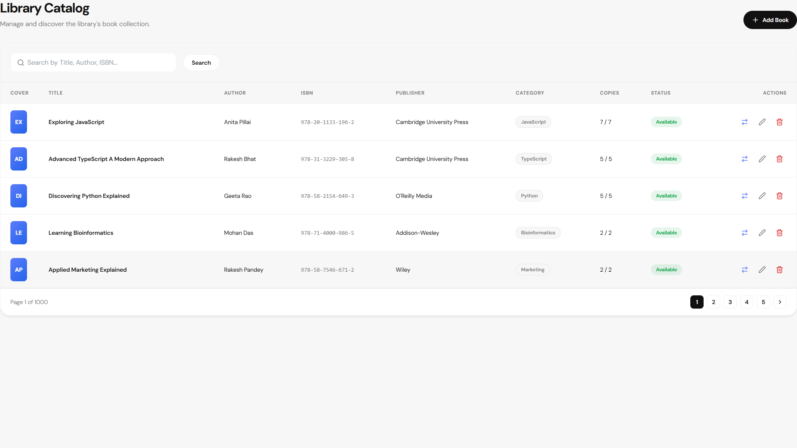
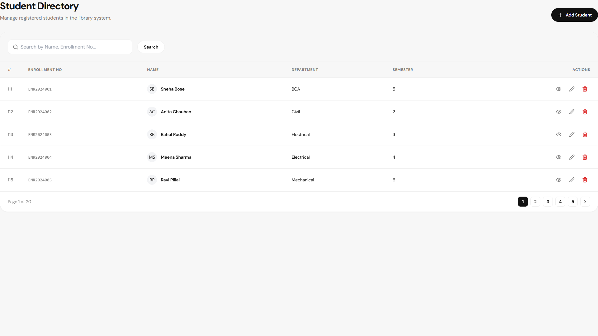
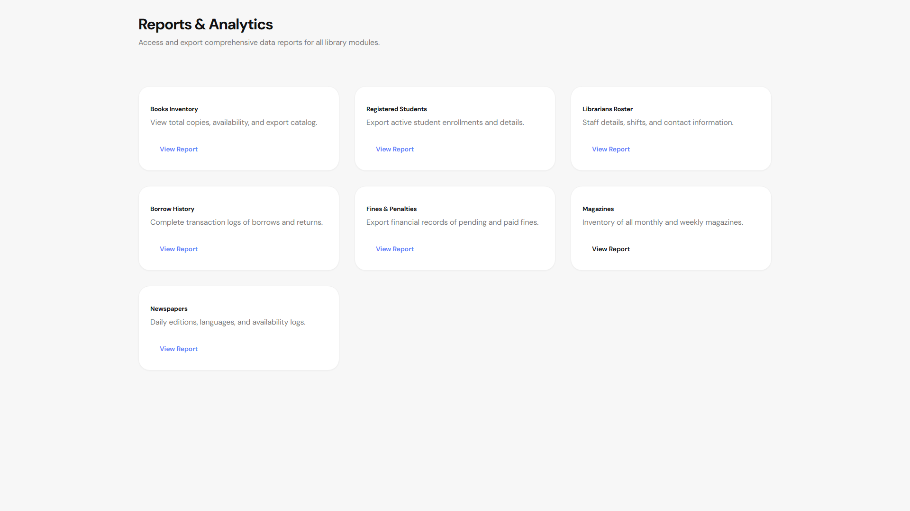
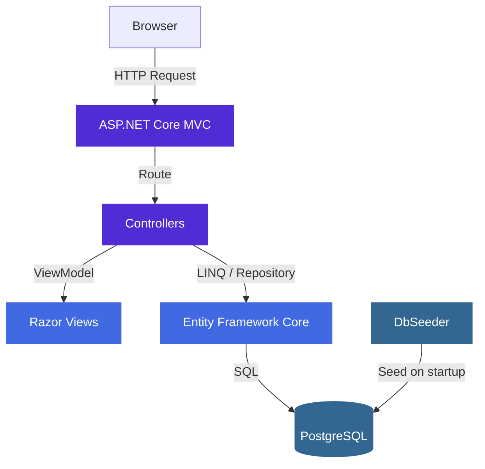

<div align="center">

<h1>Library Management System</h1>

<p>A production-grade, web-based Library Management System built with ASP.NET Core MVC (.NET 8), Entity Framework Core, and a bespoke modern design system.</p>

<p>
  
  
  
  
  
  
</p>

<p>
  
  
  
  
</p>

</div>

---

## Overview

The **Library Management System (LMS)** is an enterprise-grade web application that automates and streamlines daily library operations. Built on **ASP.NET Core MVC** with a clean, server-rendered architecture, it provides a complete workflow for managing books, tracking student borrowing, handling fines, and managing periodicals — all through a responsive, modern UI.

The system ships with a realistic seeded dataset of **5,000+ books** and hundreds of borrow records, making it suitable for live demonstration, performance testing, and recruiter review without any manual data entry.

---

## Features

| Category | Capabilities |
|---|---|
| **Authentication** | Cookie-based login/logout, role-based access control (Admin, Librarian, Student) |
| **Book Management** | Full CRUD, ISBN, category, copy tracking, availability status |
| **Borrow & Return** | Issue/return workflow, due date tracking, borrowing history |
| **Fine Management** | Automatic fine calculation, pending/paid status tracking |
| **Student Management** | Full CRUD, department assignment, borrowing profile |
| **Librarian Management** | Full CRUD, account management |
| **Periodicals** | Separate modules for Magazines and Newspapers |
| **Publications** | Publisher registry with type categorization |
| **Analytics Dashboard** | Real-time charts — borrowing trends, category breakdown, financial summary |
| **Reports** | Comprehensive operational and financial reports |
| **Search** | Global search across books, students, and librarians |
| **Seeded Data** | Auto-generated realistic dataset on first run |
| **Responsive UI** | Optimized for desktop, tablet, and mobile |

---

## Screenshots

### Landing Page


### Dashboard


### Login


### Book Catalog


### Borrow Management


### Student Management


### Reports


### Search


---

## Technology Stack

### Backend
| Technology | Purpose |
|---|---|
| ASP.NET Core MVC (.NET 8) | Web framework and request handling |
| C# 12 | Primary language |
| Entity Framework Core 8 | ORM and Code-First migrations |
| PostgreSQL (via Npgsql) | Primary database (Supabase compatible) |
| Cookie Authentication | Session management and role-based access |
| DotNetEnv | Environment variable loading |

### Frontend
| Technology | Purpose |
|---|---|
| Razor Pages | Server-rendered HTML templates |
| Bootstrap 5 | Responsive layout and base components |
| Chart.js | Analytics dashboard visualizations |
| Lucide Icons | Consistent icon system |
| Custom CSS (CSS Variables) | Bespoke design system |
| JavaScript (ES2020) | UI interactions and animations |

---

## Architecture



---

## Database Schema

```mermaid
erDiagram
    BOOKS ||--o{ BORROW_RECORDS : "borrowed in"
    STUDENTS ||--o{ BORROW_RECORDS : "makes"
    STUDENTS ||--o{ FINES : "incurs"
    BORROW_RECORDS ||--o| FINES : "generates"

    BOOKS {
        int Id PK
        string Title
        string Author
        string ISBN
        string Category
        int TotalCopies
        int AvailableCopies
        bool IsAvailable
    }
    STUDENTS {
        int Id PK
        string FullName
        string Email
        string StudentId
        string Department
    }
    BORROW_RECORDS {
        int Id PK
        int BookId FK
        int StudentId FK
        datetime BorrowDate
        datetime DueDate
        datetime ReturnDate
    }
    FINES {
        int Id PK
        int StudentId FK
        int BorrowRecordId FK
        decimal Amount
        string Status
    }
    MAGAZINES { int Id PK; string Title; string Publisher; string IssueNumber }
    NEWSPAPERS { int Id PK; string Name; datetime PublicationDate }
```

---

## Folder Structure

```text
mponline/
├── .github/
│   ├── workflows/dotnet.yml      # CI — build & validate on push/PR
│   ├── ISSUE_TEMPLATE/           # Bug report and feature request templates
│   └── PULL_REQUEST_TEMPLATE.md
│
├── LibraryManagement.MVC/        # Main application project
│   ├── Controllers/              # 12 controllers (Books, Borrow, Fines, Reports…)
│   ├── Models/                   # 9 domain entities (Book, Student, BorrowRecord…)
│   ├── ViewModels/               # View-specific DTOs
│   ├── Views/                    # Razor pages, organized by controller
│   ├── Data/
│   │   └── LibraryDbContext.cs   # EF Core DbContext
│   ├── wwwroot/                  # Static assets (CSS, JS, images)
│   ├── DbSeeder.cs               # Realistic dataset generator (5,000+ records)
│   ├── Program.cs                # Entry point, DI container, middleware pipeline
│   ├── appsettings.json          # Application configuration
│   └── .env.example              # Environment variable template
│
├── docs/
│   ├── screenshots/              # 14 UI screenshots referenced in this README
│   └── diagrams/                 # Mermaid source files for architecture diagrams
│
├── scripts/                      # Utility scripts (diagram generation, image export)
├── CONTRIBUTING.md
├── LICENSE
└── README.md
```

---

## Installation

### Prerequisites

| Requirement | Version |
|---|---|
| .NET SDK | 8.0 or later |
| Visual Studio | 2022 (recommended) or VS Code |
| PostgreSQL | 15+ (local) or Supabase (cloud) |
| Git | Latest |

### Steps

**1. Clone the repository**
```bash
git clone https://github.com/Aditya4860/LMS.git
cd LMS
```

**2. Configure the database connection**

Copy the environment template and fill in your database credentials:
```bash
cp LibraryManagement.MVC/.env.example LibraryManagement.MVC/.env
```

Edit `.env`:
```env
DATABASE_URL="Host=localhost;Port=5432;Database=library_db;Username=postgres;Password=your_password;"
```

> For Supabase, use the connection pooler URL from your project's **Settings → Database** page.

**3. Restore NuGet packages**
```bash
dotnet restore
```

**4. Apply migrations and seed data**
```bash
dotnet ef database update --project LibraryManagement.MVC
```

> The seeder runs automatically on first startup if the database is empty.

**5. Run the application**
```bash
dotnet run --project LibraryManagement.MVC
```

The application starts at `https://localhost:5001` (or `http://localhost:5000`).

---

## Demo Credentials

| Role | Email | Password |
|------|-------|----------|
| Administrator | `admin@libraryspace.com` | `Password123!` |
| Librarian | `librarian@libraryspace.com` | `Password123!` |
| Student | `student@libraryspace.com` | `Password123!` |

---

## Seeded Dataset

The application auto-generates a realistic dataset on first run:

| Entity | Count |
|---|---|
| Books | ~5,000 (valid ISBNs, categorized) |
| Students | ~100 (across multiple departments) |
| Librarians | 15–20 |
| Magazines | 20 |
| Newspapers | 10 |
| Borrow Records | 600–800 |
| Fines | ~150 (including pending) |

---

## Roadmap

- [ ] QR code book checkout via mobile scanning
- [ ] Email notifications for due dates and fine alerts
- [ ] Azure deployment with GitHub Actions CI/CD pipeline
- [ ] Dark mode system-wide toggle
- [ ] Progressive Web App (PWA) support
- [ ] AI-powered book recommendations based on borrowing history
- [ ] Barcode scanner integration for librarians

---

## Contributing

Contributions are welcome. Please read [CONTRIBUTING.md](CONTRIBUTING.md) before opening a pull request.

1. Fork the repository
2. Create a feature branch (`git checkout -b feat/your-feature`)
3. Commit using [Conventional Commits](https://www.conventionalcommits.org/) (`git commit -m 'feat: add QR checkout'`)
4. Push and open a Pull Request against `main`

---

## License

This project is licensed under the [MIT License](LICENSE).

---

## Author

**Aditya Jain** — CS Engineering Student, VIT Bhopal University

[](https://github.com/Aditya4860)
[](https://www.linkedin.com/in/aditya-jain0315/)
