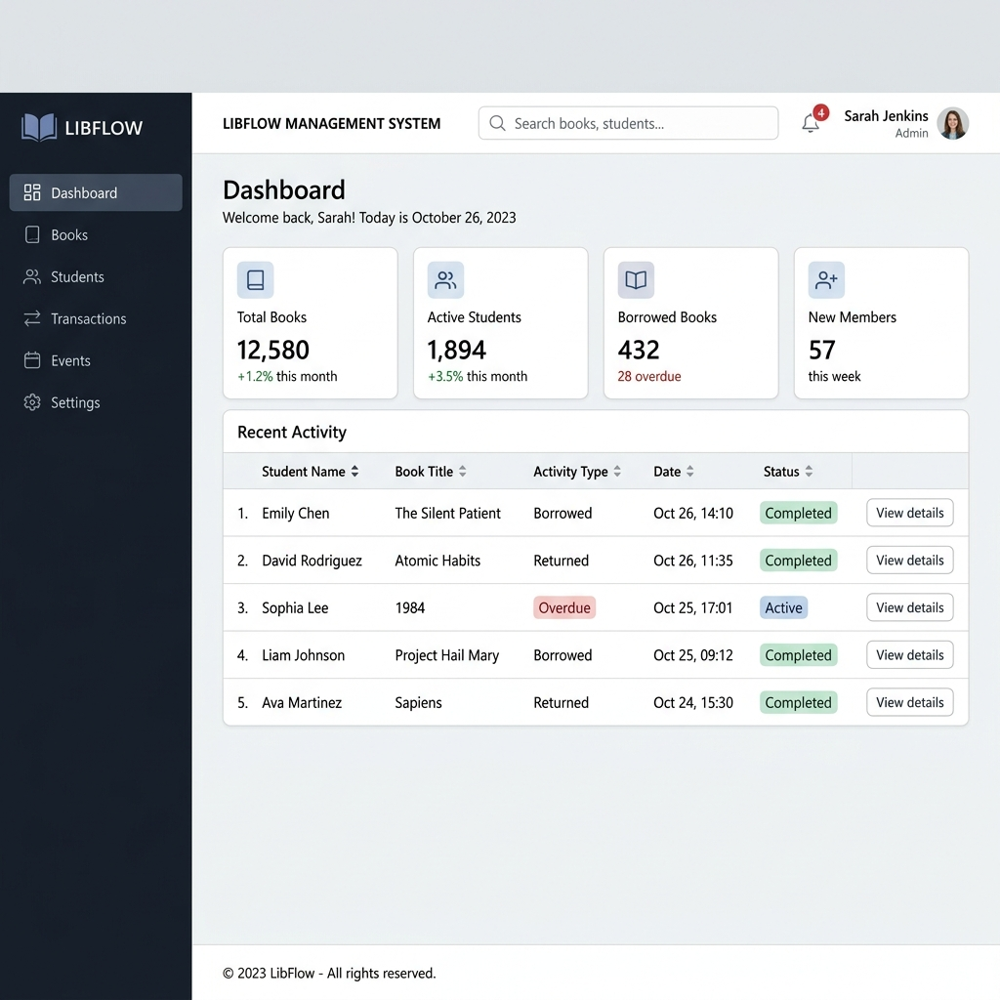
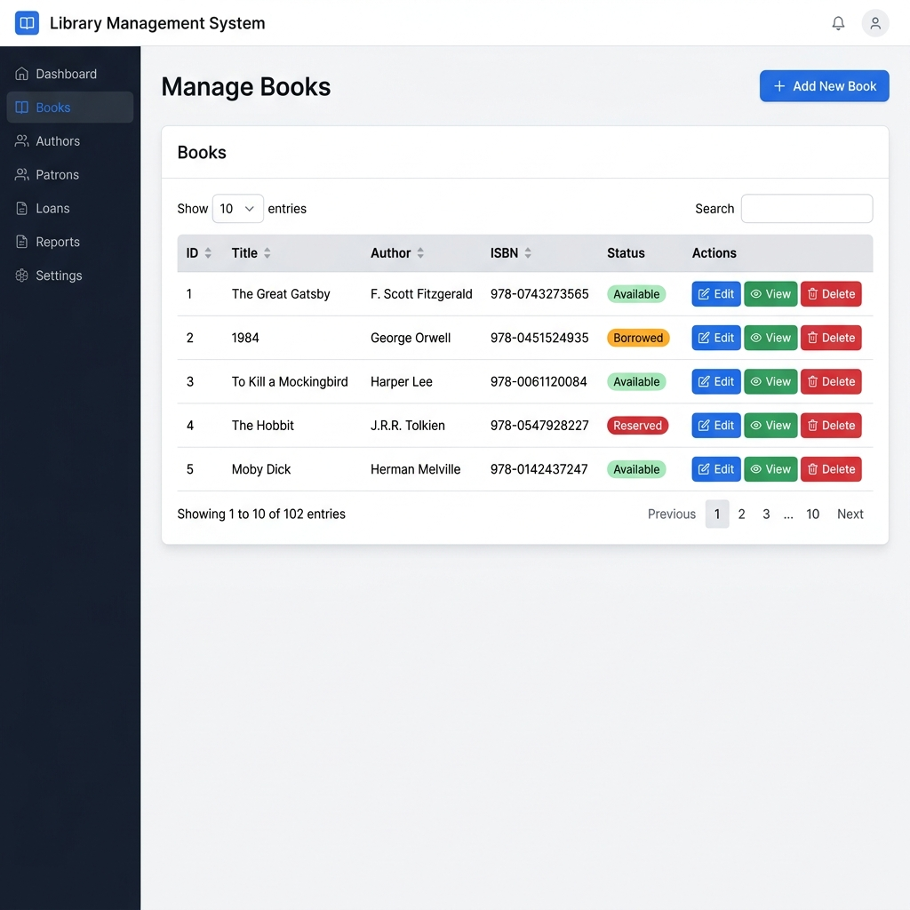
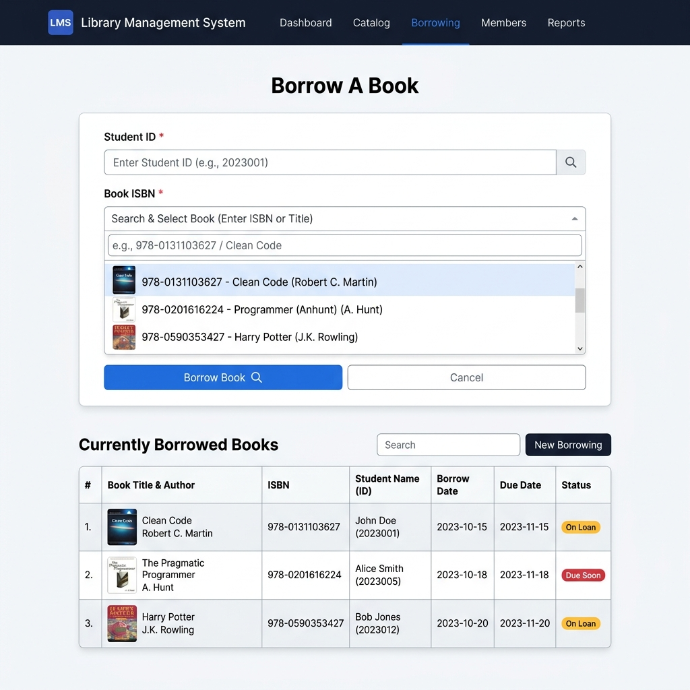
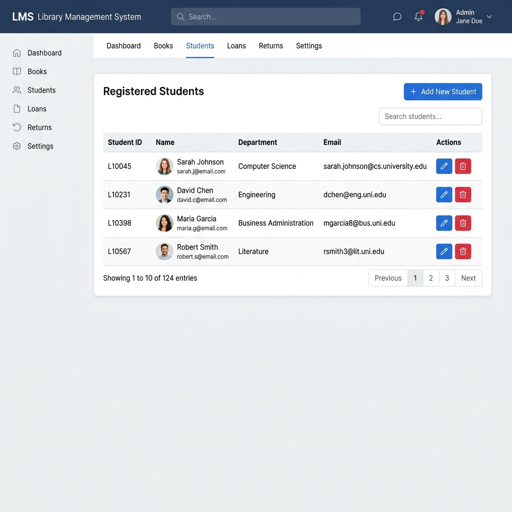
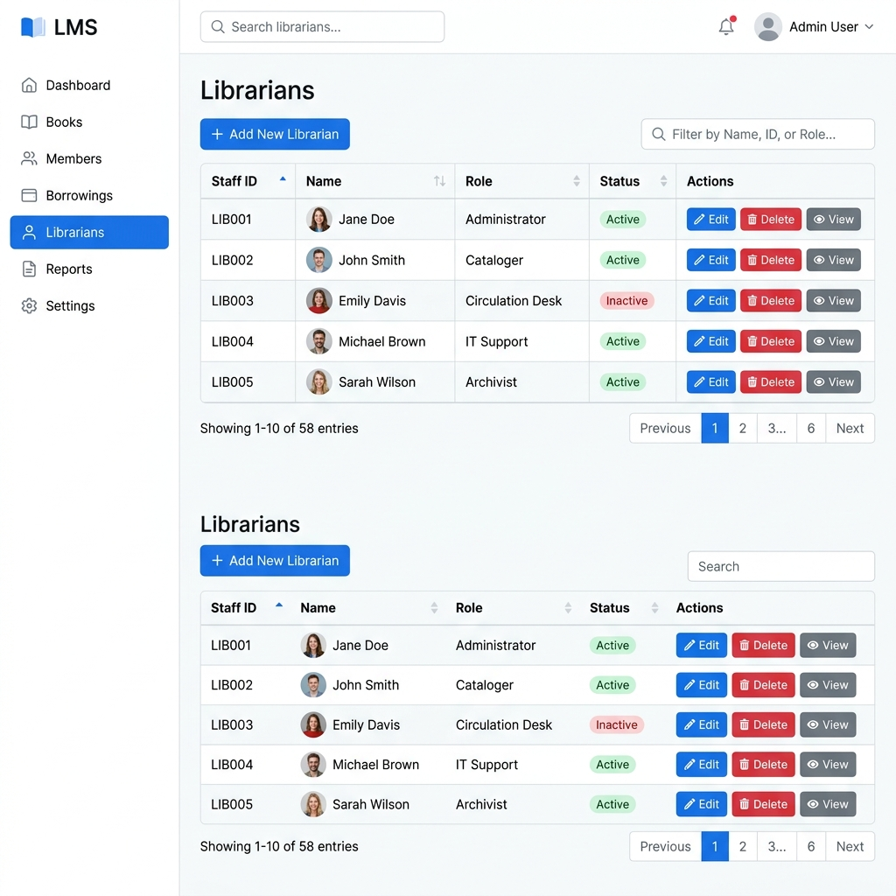
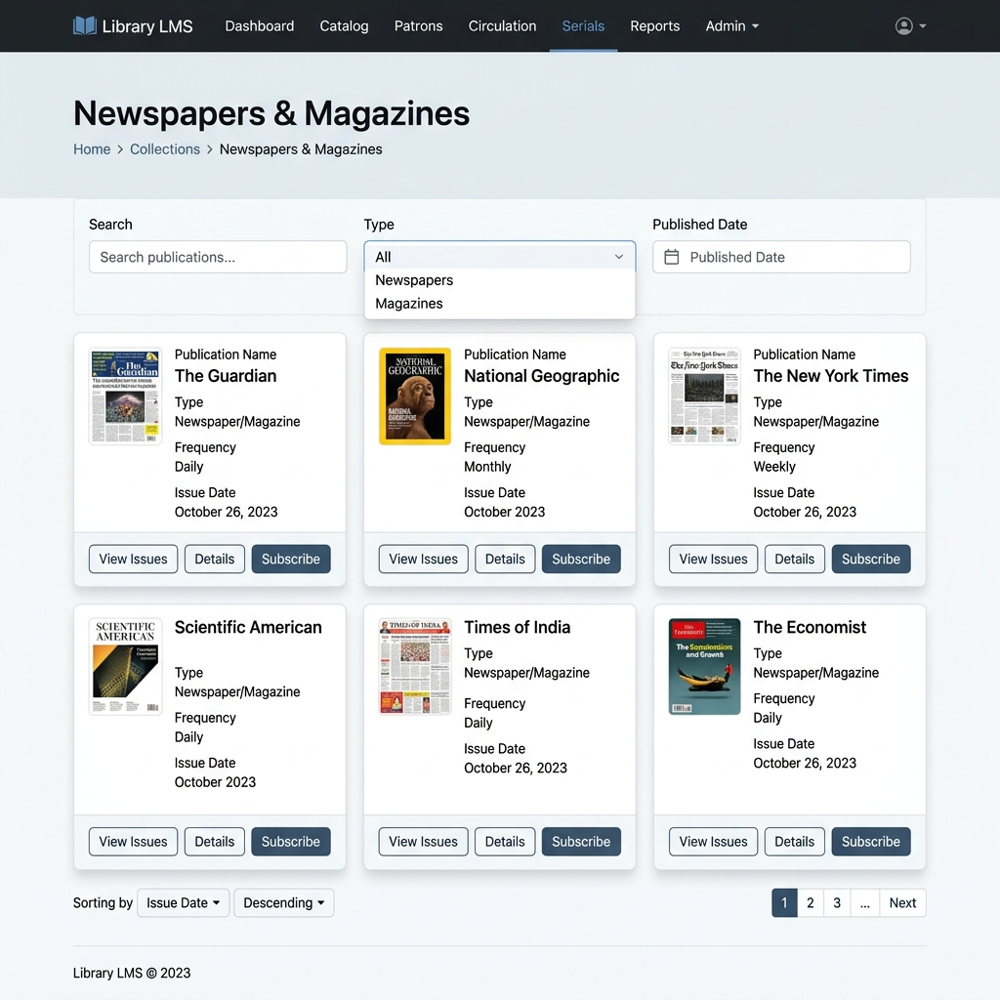
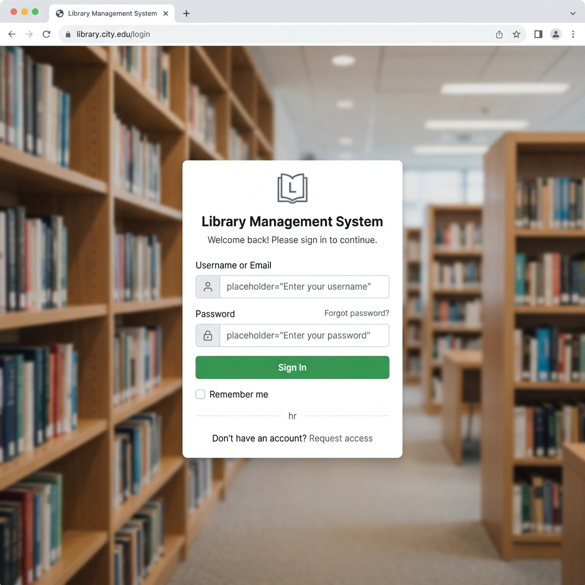

<div align="center">
  <h1>📚 Library Management System (LMS)</h1>
  <p>A modern, efficient, and user-friendly web application for managing library operations.</p>

  <!-- Badges -->
  <p>
    
    
    
    
    
    
    
  </p>
</div>

---

## 📑 Table of Contents
- [Project Overview](#-project-overview)
- [Features](#-features)
- [Technology Stack](#-technology-stack)
- [Screenshots](#-screenshots)
- [Database Schema Overview](#-database-schema-overview)
- [Folder Structure](#-folder-structure)
- [Installation Guide](#-installation-guide)
- [How to Run Locally](#-how-to-run-locally)
- [Future Enhancements](#-future-enhancements)
- [Learning Outcomes](#-learning-outcomes)
- [License](#-license)
- [Author](#-author)

---

## 🚀 Project Overview

The **Library Management System (LMS)** is a comprehensive web-based application designed to automate and simplify everyday library operations. Built with a robust **ASP.NET Core MVC** architecture and .NET 8, it provides an intuitive interface for librarians to manage books, track student borrowing, and maintain digital records of newspapers and magazines. 

With built-in authentication, a dynamic dashboard, and responsive UI using Bootstrap 5, the system ensures seamless user experiences across devices.

---

## ✨ Features

### Current Modules
- **🔐 Authentication:** Secure Login and Logout functionality.
- **📊 Dashboard:** Interactive dashboard with overall statistics and quick metrics.
- **📚 Books CRUD:** Complete management of books (Create, Read, Update, Delete).
- **🔄 Borrow & Return:** Efficient tracking of book circulation.
- **🎓 Students CRUD:** Manage student profiles and library access.
- **🧑‍💼 Librarians CRUD:** Administer librarian accounts.
- **📰 Newspapers & Magazines CRUD:** Catalog and track periodicals.
- **🔍 Search:** Quick and advanced search capabilities.
- **📄 Pagination:** Organized data displays for large datasets.

---

## 💻 Technology Stack

### Backend
- **Framework:** ASP.NET Core MVC (.NET 8)
- **Language:** C#
- **ORM:** Entity Framework Core
- **Database:** SQL Server

### Frontend
- **Markup/Styling:** HTML5, CSS3
- **CSS Framework:** Bootstrap 5
- **Scripting:** JavaScript

---

## 🏛️ Architecture

The application is built using the **Model-View-Controller (MVC)** architectural pattern:
- **Models:** Represent the domain entities (Books, Students, etc.) and handle data logic. Mapped to SQL Server using Entity Framework Core.
- **Views:** Built with Razor syntax (`.cshtml`), rendering dynamic HTML via Bootstrap 5 and handling the user interface.
- **Controllers:** Handle incoming HTTP requests, interact with the Models/Database Context, and return the appropriate Views or responses.
- **ViewModels:** Specialized DTOs used to pass tailored data between Controllers and Views, ensuring separation of concerns and data security.

The system utilizes **Dependency Injection (DI)** (built into .NET Core) to inject the database context and other services into controllers, promoting loose coupling and maintainability.

---

## 📸 Screenshots

> *Note: These are mock screenshots illustrating the modern UI of the application.*

| Dashboard | Books Module |
| :---: | :---: |
|  |  |
| **Borrow Module** | **Student Module** |
|  |  |
| **Librarian Module** | **Publication Module** |
|  |  |
| **Login Page** | |
|  | |

---

## 🗄️ Database Schema Overview

The system uses a relational database design managed through Entity Framework Core Code-First migrations. Key entities include:
- `Book`: Details of available books in the library.
- `Student`: Information about registered students.
- `Librarian`: Staff account details.
- `BorrowRecord`: Tracks book checkouts and returns, associating a `Student` and a `Book`.
- `Newspaper` & `Magazine`: Details of available periodicals.

---

## 📁 Folder Structure

```text
LibraryManagement.MVC/
│
├── Controllers/       # Handles incoming HTTP requests & application logic
├── Data/              # Database context & Entity Framework configuration
├── Models/            # Domain entities representing DB tables
├── ViewModels/        # DTOs specifically structured for Views
├── Views/             # Razor pages (UI templates)
│   ├── Books/
│   ├── Student/
│   └── Shared/        # Layouts, partial views (e.g., _ValidationScriptsPartial)
├── wwwroot/           # Static assets (CSS, JS, Images, Libs)
├── appsettings.json   # App configuration & connection strings
├── DbSeeder.cs        # Database seeding logic
└── Program.cs         # App entry point & dependency injection setup
```

---

## 🛠️ Installation Guide

### Prerequisites
Before you begin, ensure you have the following installed:
1. [.NET 8.0 SDK](https://dotnet.microsoft.com/download/dotnet/8.0)
2. [Visual Studio 2022](https://visualstudio.microsoft.com/) (recommended) or VS Code
3. [SQL Server](https://www.microsoft.com/en-us/sql-server/sql-server-downloads) (Express or Developer Edition)

### Setup Steps
1. **Clone the repository:**
   ```bash
   git clone https://github.com/Aditya4860/LMS.git
   cd LMS
   ```

2. **Configure Database Connection:**
   Open `appsettings.json` in the `LibraryManagement.MVC` project and update the `DefaultConnection` string with your SQL Server instance details.

3. **Apply Migrations:**
   Open the Package Manager Console in Visual Studio and run:
   ```powershell
   Update-Database
   ```
   *Alternatively, using the .NET CLI:*
   ```bash
   dotnet ef database update --project LibraryManagement.MVC
   ```

---

## 🏃 How to Run Locally

1. Open the solution file (`LibraryManagement.slnx` or `.sln`) in Visual Studio.
2. Ensure `LibraryManagement.MVC` is set as the **Startup Project**.
3. Press `F5` or click **Start** to run the application in debug mode.
4. The application will launch in your default web browser (typically on `http://localhost:5000` or `https://localhost:5001`).

---

## 🔮 Future Enhancements

The following features are in the pipeline for future releases:
- [ ] **Role-Based Authentication:** Fine-grained access control for Admins, Librarians, and Students.
- [ ] **Borrow History:** Detailed logs of past borrowing activities for students.
- [ ] **Fine Calculation:** Automated calculation of late return fees.
- [ ] **Notifications:** Email or in-app alerts for due dates.
- [ ] **Reports:** Exportable PDF/Excel reports for library inventory and activity.
- [ ] **Categories:** Advanced categorization and tagging for media.
- [ ] **Public Pages:** "About Us" and "Contact Us" pages for end-users.

---

## 🧠 Learning Outcomes

Building this project helped reinforce the following concepts:
- Designing a robust MVC architecture in ASP.NET Core.
- Implementing CRUD operations seamlessly.
- Handling relational data and migrations using Entity Framework Core.
- Securing web applications with authentication.
- Developing responsive and user-friendly interfaces using Bootstrap 5 and Razor Views.
- Form validation and data binding in .NET.

---

## 🤝 Acknowledgements

- [ASP.NET Core Documentation](https://learn.microsoft.com/en-us/aspnet/core)
- [Entity Framework Core](https://learn.microsoft.com/en-us/ef/core)
- [Bootstrap 5](https://getbootstrap.com/)
- [Shields.io](https://shields.io/) for repository badges

---

## 📄 License

This project is licensed under the [MIT License](LICENSE). Feel free to use, modify, and distribute as per the terms of the license.

---

## 👨‍💻 Author

**Aditya** 
- GitHub: [@Aditya4860](https://github.com/Aditya4860)

---
<div align="center">
  <i>If you found this project helpful, please consider giving it a ⭐️!</i>
</div>
